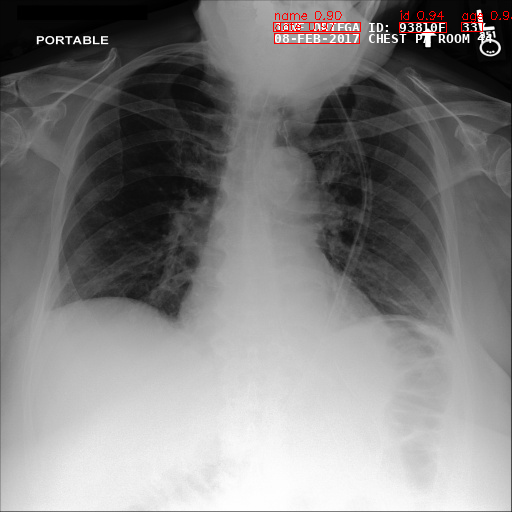
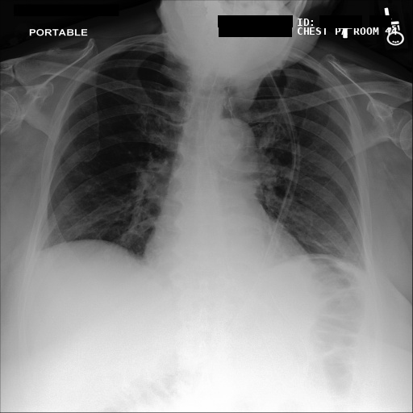
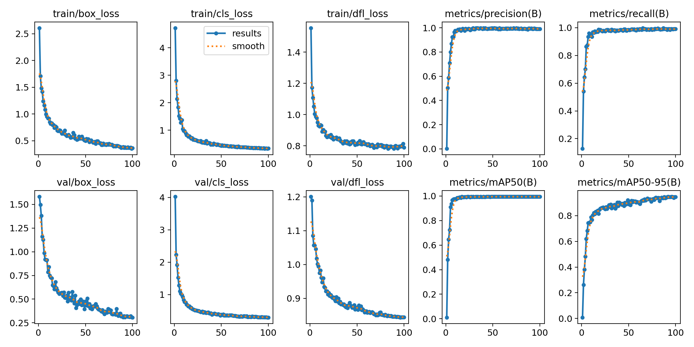
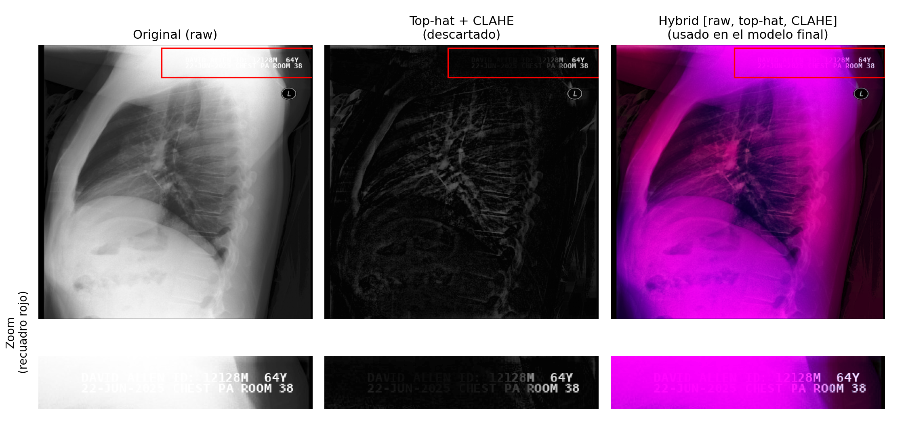

# Desidentificación Visual de Radiografías — HackAI-Biomed (Reto Treelogic)

**Reto:** las radiografías del dataset llevan "quemada" sobre la propia imagen
información del paciente (nombre, ID, edad, fecha y hora del estudio). El
objetivo es **localizar y eliminar automáticamente ese texto sensible**,
dejando intacto el resto de la imagen — incluida metadata no sensible como
`CHEST PA`, `PORTABLE` o el número de habitación — para que la radiografía
pueda compartirse o reutilizarse sin comprometer la privacidad del paciente.

Este repo contiene el pipeline completo de extremo a extremo: **detección**
del texto sensible con un modelo YOLO11n entrenado para este dominio,
**enmascarado** irreversible (caja negra) sobre la imagen original, y una
**verificación OCR** posterior que confirma que no queda ningún texto legible.

> **Memoria técnica**: [`memoria_tecnica.pdf`](memoria_tecnica.pdf) ·
> **Vídeo de presentación**: [`slides_video.pdf`](slides_video.pdf)

---

## Resultado

| | |
|---|---|
|  |  |
| Detecciones (`detect.py`) | Imagen anonimizada (`anonymize.py`, modo `blackbox`) |

El bloque `CHEST PT ROOM` permanece visible: es metadata no sensible, nunca
etiquetada como clase confidencial, por lo que el modelo no la toca.

---

## Pipeline

1. **Preprocesado** (`src/prepare_dataset.py`) — variante `hybrid`: apila
   `[raw, top-hat, CLAHE]` como 3 canales de entrada.
2. **Detección** (`src/train.py` / `models/deid_hybrid/weights/best.pt`) —
   YOLO11n, `imgsz=512`, `conf=0.15`.
3. **Enmascarado** (`src/anonymize.py`) — `blackbox` (caja negra) con
   *padding* de 3 px alrededor de cada caja detectada.
4. **Verificación OCR** (`src/anonymize.py --ocr-check`, EasyOCR) — relee la
   imagen enmascarada y reporta cualquier texto residual en `report.json`.

El detector **no lee** el texto — aprende la *firma visual* de cada clase
(una fecha es un bloque ancho de dígitos con guiones, una edad es un token
corto `61Y`, un nombre es un bloque alfabético largo) junto con su posición
habitual. La distinción "sensible vs. metadata" viene íntegramente del
etiquetado del dataset.

Dos scripts auxiliares completan el pipeline:
- `src/detect.py` — dibuja las cajas detectadas sobre una imagen nueva, sin
  enmascarar (debug / demos).
- `src/visualize.py` — superpone cajas reales y predichas sobre el conjunto
  de validación, para inspección visual.

---

## Quick start

```bash
pip install -r requirements.txt

# Anonimizar las imágenes de muestra de inputs/
python src/anonymize.py --weights models/deid_hybrid/weights/best.pt \
    --source inputs --variant hybrid --mode blackbox --ocr-check
```

El modelo ya entrenado está incluido en
`models/deid_hybrid/weights/best.pt` — **no es necesario reentrenar** para
anonimizar nuevas imágenes con las mismas 5 clases. Los pasos 1–2 (más abajo)
solo son necesarios si se quiere reproducir el entrenamiento desde cero.

> **Nota de red**: `--ocr-check` usa EasyOCR, que descarga su modelo de
> reconocimiento la primera vez que se ejecuta. La inferencia con
> `anonymize.py` / `detect.py` (sin `--ocr-check`) solo necesita
> `models/deid_hybrid/weights/best.pt` y funciona totalmente offline.

### Anonimizar una imagen nueva

```bash
python src/anonymize.py --weights models/deid_hybrid/weights/best.pt \
    --source /ruta/a/radiografia.png --variant hybrid --mode blackbox --ocr-check
```

Las imágenes enmascaradas se guardan en `outputs/anonymized/`, junto con un
`report.json` con cada caja detectada y cualquier texto que el OCR pudiera
seguir leyendo. `--variant hybrid` es obligatorio (aplica el mismo
preprocesado con el que se entrenó el modelo).

### Ver solo las detecciones (sin enmascarar)

```bash
python src/detect.py --source /ruta/a/radiografia.png
```

Escribe en `outputs/detections/`: la imagen con las cajas dibujadas
(`<nombre>.png`), las detecciones en formato tabla (`<nombre>.txt`: clase,
confianza, coordenadas) y un `report.json` combinado.

---

## Pipeline completo (entrenamiento incluido)

```bash
# 1. Construir los datasets de entrenamiento (variante hybrid)
python src/prepare_dataset.py

# 2. Entrenar el detector (ya hecho — el resultado está en models/deid_hybrid/)
python src/train.py --variant hybrid --epochs 100

# 3. Evaluar el modelo entrenado
python src/evaluate.py --weights models/deid_hybrid/weights/best.pt --variant hybrid

# 4. Anonimizar (detectar + enmascarar + verificar con OCR)
python src/anonymize.py --weights models/deid_hybrid/weights/best.pt \
    --source data/images/val --variant hybrid --mode blackbox --ocr-check
```

---

## Resultados (conjunto de validación, 80 imágenes)

| métrica | valor | significado |
|---|---|---|
| mAP@50 | 0.987 | calidad global de detección |
| mAP@50-95 | 0.944 | ajuste de las cajas |
| **recall** | **0.991** | **fracción de texto sensible localizado — dato crítico de privacidad** |
| precisión | 0.993 | fracción de detecciones correctas |

AP@50 por clase: `name` 0.995 · `id` 0.995 · `age` 0.995 · `date` 0.995 ·
`time` 0.955 (algo menor por tener menos ejemplos de entrenamiento).

**Verificación OCR**: tras enmascarar las 80 imágenes de validación,
EasyOCR no detectó **ninguna fuga de información de paciente**. El único
texto legible restante es metadata no sensible (`CHEST PA`, `PORTABLE`,
números de habitación, y las etiquetas `PT:` / `MRN:` ya vacías).

> Estas métricas son sobre el conjunto de **validación**, usado también
> para seleccionar el mejor *checkpoint*. Para un número "a prueba de
> auditoría" haría falta una partición de test independiente — ver
> [`memoria_tecnica.pdf`](memoria_tecnica.pdf), sección de conclusiones.



---

## Preprocesado: por qué `hybrid`

Un primer enfoque (top-hat morfológico + CLAHE) resalta el texto blanco sobre
fondos oscuros, pero **suprime** el texto que cae sobre zonas anatómicas
brillantes (p. ej. un campo pulmonar muy expuesto), justo donde más falta
hace detectarlo.

La variante `hybrid` (`src/prepare_dataset.py`) apila **tres vistas** de la
misma imagen como los 3 canales de entrada del modelo:

```
canal 0 = escala de grises original   (texto visible sobre fondos oscuros)
canal 1 = top-hat morfológico         (texto como estructuras brillantes)
canal 2 = CLAHE(original)             (contraste local realzado)
```

Así el modelo dispone siempre de al menos un canal con señal robusta. Una
comparativa A/B (15 épocas) confirmó la elección: recall prácticamente
idéntico (0.971 en ambas), pero `hybrid` produce cajas más ajustadas
(mAP@50-95 0.842 frente a 0.831 de `raw`).



> Las imágenes de la variante `hybrid` se ven "rosáceas" en un visor
> normal — es esperado, los 3 canales son *features*, no una imagen RGB
> real. Las salidas anonimizadas finales son siempre la imagen original en
> escala de grises.

---

## Decisiones de diseño

- **Augmentación específica para texto** (`train.py`): sin flips / rotación /
  shear / mosaico / *random erasing* — las cajas de *ground truth* miden
  ~9 px de alto a 512 px y estas augmentaciones estándar de YOLO las
  destruirían. Solo traslación (±10 %), escala (±20 %) y *jitter* de brillo.
- **Recall por encima de precisión** (`anonymize.py`): inferencia a
  `conf=0.15` con *padding* de 3 px — una caja no detectada es una fuga de
  datos de paciente; una caja de más solo cuesta unos píxeles.
- **OCR como red de seguridad**: `--ocr-check` verifica de forma
  independiente la imagen ya enmascarada.
- **Modelo**: YOLO11n preentrenado en COCO, *fine-tuning* por transfer
  learning, `imgsz=512`, entrenamiento en CPU (4 núcleos / 8 GB, `batch=4`).

### Añadir una clase nueva más adelante

El modelo solo conoce las 5 clases con las que se entrenó. Para detectar algo
nuevo: (1) anota ese texto en los ficheros de `data/labels/` con un nuevo
`class_id`, (2) actualiza `nc` y `names` en `data/data.yaml`, y (3) reentrena
— lo más rápido es partir de `models/deid_hybrid/weights/best.pt`:

```bash
python src/train.py --variant hybrid --epochs 50 \
    --model models/deid_hybrid/weights/best.pt --name deid_v2
```

Para anotar, [Roboflow](https://roboflow.com) o [makesense.ai](https://makesense.ai)
exportan directamente en formato YOLO (`.txt`), compatible con
`data/labels/{train,val}/`.

---

## Estructura del repo

```
.
├── README.md
├── requirements.txt
├── data.yaml                  ← config original del reto (5 clases)
├── memoria_tecnica.pdf         ← memoria técnica (entregable)
├── slides_video.pdf            ← vídeo de presentación (entregable)
├── src/                        ← el pipeline (ejecutar desde la raíz del repo)
│   ├── prepare_dataset.py       1. construir datasets de entrenamiento
│   ├── train.py                 2. entrenar el detector
│   ├── evaluate.py              3. medir precisión / recall
│   ├── anonymize.py              4. detectar + enmascarar + OCR (el producto)
│   ├── detect.py                    detectar y dibujar cajas (debug/demo)
│   └── visualize.py                 GT vs. predicción (inspección visual)
├── models/
│   └── deid_hybrid/             modelo entrenado + curvas/plots
│       └── weights/best.pt       EL MODELO (usar para inferencia)
├── data/                        dataset (400 imágenes + etiquetas YOLO)
│   ├── images/{train,val}/
│   └── labels/{train,val}/
├── inputs/                       2 radiografías de muestra para demo rápida
└── docs/
    └── figures/                  figuras usadas en este README
```

`datasets/`, `outputs/` y `runs/` se generan al ejecutar el pipeline
(`prepare_dataset.py`, `anonymize.py`/`detect.py`, `train.py`
respectivamente) y no se versionan — ver `.gitignore`.

---

## Referencia de clases

| id | clase | ejemplo |
|----|-------|---------|
| 0 | `name` | `PT: ANTHONY HARRIS` |
| 1 | `id`   | `ID: 31417` |
| 2 | `age`  | `61Y` |
| 3 | `date` | `2025-08-11` |
| 4 | `time` | `07:38` |
